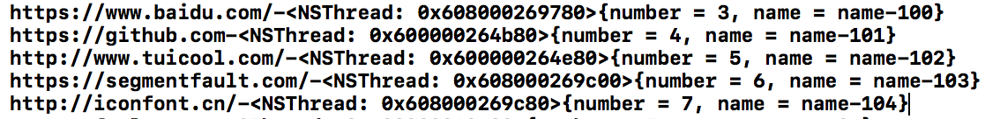
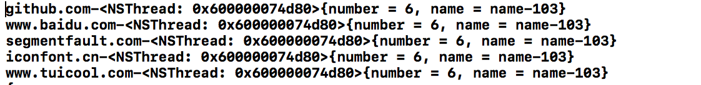

# HNetWorkListen
收集所有网络请求数据，便于数据分析和优化网络

* Fishhook
	* 不支持fishhok 懒加载的库 ， 必须是系统启动加载
	* 如果你hook的库 函数   仅仅在库内部调用 那么你的hook是没有用的 ,必须是其他库调用该函数才会被hook
	* ios将会 改变 Mash-O文件结构  使用 dyld 3    /   fishhook将会失效

* 解决hook 后，仅仅调用一次
	* 重新加载该库
		```
		void *lib = dlopen("/usr/lib/system/libsystem_dnssd.dylib", RTLD_NOW);
		```
	* 手动获取需要hook的函数地址
		```
			orig_DNSServiceGetAddrInfo = dlsym(lib, "DNSServiceGetAddrInfo");
		```
	* 重新绑定
		```
		rebind_symbols((struct rebinding[1]){{"DNSServiceGetAddrInfo",my_DNSServiceGetAddrInfo}}, 1);
		```
* DNS 解析出现的问题（Session  ios9.3）

	```
	问题:
		由于网络任务是异步 无序的任务 所有DNS解析都会走  my_DNSServiceGetAddrInfo  在该方法中 如何和当前任务进行匹配 进行数据收集
	
	解决思路:
		每个任务 都会在独自线程中执行   创建线程和任务的对应关系来匹配 然后在DNS 方法中通过当前线程 得到当前任务
		
	如何创建对应关系
		○ HClassDocument 打印SessionTask Methos 后 试图通过修改内部方法得到当前任务和线程的对应关系
		○ -(id)_onqueue_strippedMutableRequest{} 最后选择了该方法进行
			§ 该方法会在DNS解析之前调用
			§ 任务执行整个周期内 仅仅会被调用一次
注意:由于Session内部创建队列（workQueue 属性）来管理任务 也会在某一任务完成后 回收重新利用线程 ，所以你在某一任务完成后 更新对应关系表

	为什么还是无法解决问题:
		！！为什么DNS解析会在同一线程完成 而不是在各自任务的线程完成
	```
*
		
		